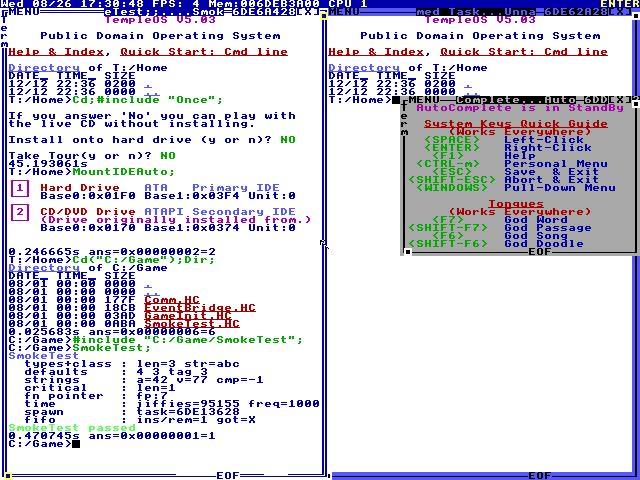
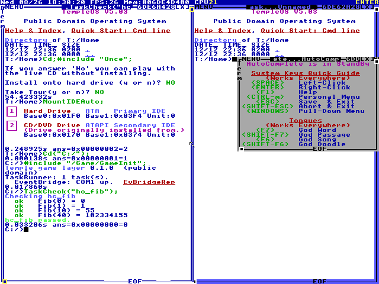

<div align="center">

# Temple

### A programming puzzle game and an interactive museum, built on the real TempleOS

*In memory of Terry A. Davis, 1969–2018*

**€1 from every copy sold goes to the Brain &amp; Behavior Research Foundation and NAMI —
the organizations Terry's family asked people to support.**

[](#roadmap)
[](https://templeos.org)
[](#license)
[](#)

</div>

---

> Terry A. Davis wrote an entire 64-bit operating system alone, over more than a decade —
> kernel, compiler, graphics stack, editor, games — and put all of it in the public domain.
> This project does not imitate that work. It runs it.

Temple is a campaign that teaches you HolyC inside the actual operating system, an arcade of
the games Terry shipped with it, and a museum that explains his design decisions using his own
words, with a path to the source file behind every claim.

<div align="center">




<sub><i>Not mock-ups. Left: the game layer, written on the host, copied into the disk image,
compiled by Terry's compiler and run. Right: the first campaign task being checked — the
player's function compiled and called for each case, inside TempleOS 5.03 under QEMU.
Arcade and museum screenshots follow as those are built; see <a href="#roadmap">Roadmap</a>.</i></sub>

</div>

---

## What it is

**Campaign.** Ten chapters, from your first `Dir;` to a game of your own that lives in `/Home`
and still runs after the credits. You write real HolyC and it is compiled by Terry's compiler,
in ring 0, on a real 640×480 sixteen-colour screen. Nothing is simulated.

**Arcade.** The games that ship inside the OS, launchable in one click, each with a card on what
is technically interesting about it.

**Museum.** The timeline, the Charter, and a screen on why 640×480, sixteen colours, no
networking and a single address space were choices rather than shortcomings — argued in his
words, with the file path next to each quote.

**Sandbox.** Stock TempleOS 5.03, unmodified, yours to poke at.

### What it is not

Not a parody, not a meme, and not a shrine. There is no narrator speaking as Terry, no
AI-generated text in his style, no invented quotes, and nothing about the circumstances of his
death. The religious character of the OS is shown as what it is — a set of functions and a
design intent — explained in his words, without editorializing in either direction.

---

## Status

**Pre-alpha.** No playable build yet. Current work is source analysis and runtime bring-up.

What exists and works today:

| | |
|---|---|
| `tools/loc_count.py` | LOC across the snapshot, separating DolDoc binary payloads from text |
| `tools/extract_compiler_errors.py` | 149 compiler messages pulled from the compiler source |
| `tools/run_qemu.sh` | Reproducible launch, using Terry's own QEMU flags |
| `tools/eventbridge_host.py` | Host end of the guest bridge — 17/17 parser tests pass |
| `tools/qemu_drive.py` | Drives the guest over QMP — screenshots, keystrokes, no human needed |
| `tools/fat32.py` | Reads and writes the guest's filesystem from the host, so the layer can be dropped straight into the image |
| `guest/Game/*.HC` | Serial transport and the event protocol, inside the OS |
| `guest/Game/SmokeTest.HC` | Every HolyC construct the layer relies on — compiled and run in a live guest, all passing |
| `guest/Game/TaskRunner.HC` | Loads a task, compiles the player's answer and calls it case by case |
| `tools/lint_holyc.py` | Catches the HolyC traps that fail silently — see below |
| `data/api_index.json` | Every OS function the campaign touches, with its real signature and defining line |

The path from a file on this machine to running code inside the OS is closed: the host
writes into the guest's FAT32 partition, TempleOS mounts it, and `#include` compiles it.
Everything the bridge needs — the FIFO primitives, interrupt-safe sections, `Spawn`,
port I/O — compiles and runs.

The first campaign task runs the whole way through: the task is defined in
`data/tasks/hc_fib.json`, generated into HolyC, deployed into the image, and checked
inside the OS by compiling the player's file and calling their function for each case.
The untouched template fails and the reference solution passes, and `task_done` reaches
the host over COM1.

The disk boots on its own now, and the layer starts with it. One line in
`/Home/MakeHome.HC` is the whole hook, so nothing under `/Kernel` or `/Adam` is touched;
after a cold boot the guest greets the host over COM1 with no command typed. The host can
then drive the campaign: `CMD check_task id=hc_fib` comes back as
`EV task_checked id=hc_fib cases=4 failed=0` followed by `EV task_done`.

What is **not** done: there is one task rather than fifty-seven, there is no arcade,
museum or launcher UI, and the installed image still stops at Terry's boot menu waiting
for a keypress, which a player should never see. Nothing here should be read as "it
works" unless this file says it ran.

---

## Getting the sources

```bash
bash tools/fetch_sources.sh
```

Clones the `cia-foundation/TempleOS` mirror of the final 5.03 snapshot into `vendor/` and pins
the commit. `vendor/` is not committed — it is somebody else's snapshot and one command
reproduces it.

```bash
python tools/loc_count.py
python tools/extract_compiler_errors.py
python tools/eventbridge_host.py --selftest
```

Booting the OS needs QEMU and the official ISO:

```bash
mkdir -p vendor/iso && curl -L -o vendor/iso/TempleOS.ISO https://templeos.org/Downloads/TempleOS.ISO
bash tools/run_qemu.sh --install
```

---

## How it is put together

```
host        launcher, museum, achievements, save data, Steam integration
  |
  |  EventBridge — ASCII lines over COM1
  v
guest       TempleOS 5.03 (public domain) + /Game layer in HolyC
```

Two findings shaped this more than anything else.

**The OS has no serial driver — but Terry wrote one.** `Kernel/SerialDev` is PS/2 keyboard and
mouse, and `0x3F8` appears nowhere in the kernel. But `Doc/Comm.HC` holds a complete 132-line
UART driver that ships with the OS and is never compiled, with his note at the top: *"Be sure
to Adam Include this by placing it in your start-up scripts."* The bridge is built on that,
with two changes — dropping a `Sleep(10)` he had already marked *"!!! Remove this line!!!"*,
and adding a receive path the original never exposed.

**Starting the game layer needs no kernel patch.** Stock `StartOS.HC` ends with
`#include "~/MakeHome"`, so the OS already hands control to a user file on the way up. One line
in `/Home/MakeHome.HC` brings up the whole layer. Nothing under `/Kernel` or `/Adam` is touched.

That matters beyond convenience: the sandbox really is stock TempleOS. Boot the image without
the launcher and you get his OS, unmodified and fully usable, with the game layer sitting
quietly on a serial port nobody is listening to.

---

## Roadmap

| Milestone | What lands |
|---|---|
| **M0** Analysis | Source analysis, corrected claim list, task and achievement data |
| **M1** Runtime | QEMU and userspace-port prototypes measured against each other; bridge running on both |
| **M2** Vertical slice | Chapters 0–2, first achievements, museum skeleton, Steam integration |
| **M3** Content | All chapters, arcade, museum, full achievement set |
| **M4** Polish | Steam Deck, localisation, accessibility, demo |
| **M5** Release | Beta → store page → Next Fest → release |

The demo will be free permanently and will include the full sandbox and the museum. Terry's
work does not go behind a paywall.

---

## License and attribution

**TempleOS is public domain**, by the author's own declaration — `Doc/Credits.DD:3`:

> "I, Terry A. Davis, wrote all of TempleOS over the past 13.9 years (full-time). … It is
> public domain, not GPL."

Repeated in `Doc/Charter.DD:56`, `Doc/FAQ.DD:3`, `Doc/Features.DD:9` and `Doc/Start.DD:3`.

The `/Game` layer in `guest/` is released into the public domain as well, continuing that.

**Not affiliated** with the author's estate or with the TempleOS community. No photographs,
video, audio or synthesized likeness of Terry Davis appear anywhere in this project.

One caveat worth stating plainly: `Misc/Bible.TXT` in the OS image is a Project Gutenberg
etext and carries their "Small Print!" licence header, which is not the same thing as plain
public domain and sets conditions on commercial redistribution. The King James text itself is
unaffected. This is handled before any paid release.

---

<div align="center">
<sub>

The best memorial for a programmer is people who learned his system.

</sub>
</div>
